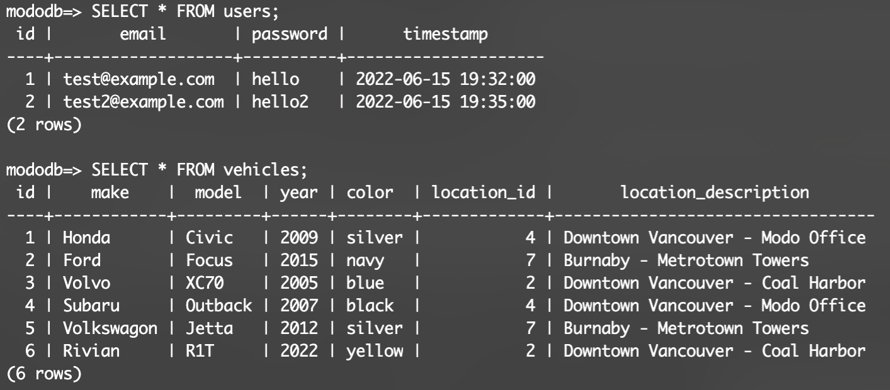

# Modo-Challange

For this project I was asled to build a web-based application composed of two pages. The first page is a login page with email and password fields. The second page retrieves and displays all vehicle data from a database. The number of vehicles in the database should not assumed to be static.

This application was built using ReactJS, ExpressJS, nodeJS & PostgreSQL.

## Getting Started

1. Clone this repository onto your local device.
2. Install dependencies on `BOTH` the front end and back end using the `npm install` command twice, once inside of the react-front-end folder and another time inside of the express-back-end folder.


## Create your Local PostgreSQL Database
3. In your terminal, `cd` into the express-back-end folder and type `psql`. (if you do not have postgress installed, install it globally using the `npm install -g pg` command)
4. Inside of the psql environment, create a new role named 'me' using the commands below:
```
CREATE ROLE me WITH LOGIN PASSWORD 'password';
```
```
ALTER ROLE me CREATEDB
```
5. type `\q` and enter to quit out of the psql environment, then type `psql -d postgres -U me` to re-enter the environment as your newly created user.
6. Next create our new database by typing `CREATE DATABASE mododb;` you can now type `\list` to view this new database. Enter into it using `\c mododb` command.
7. Check that your path ends with 'express-back-end' using the `\! pwd` command
8. Now the easy part! Create your tables and seed them using these commands:
```
\i db/migrations/01_schema.sql;
```
```
\i db/seeds/01_vehicles.sql;
```
```
\i db/seeds/02_users.sql;
```
9. Your Database should now look something like this! 



## Fire the App up! 
10. You will need two terminal tabs open, one inside of the `react-front-end` folder and another inside of the `express-back-end` folder.
11. In the express-back-end tab, type `npm run start`, this will boot up the server. 
12. In the react-front-end tab, type `npm start`.

